# Translation Service - Cloud Computing und Big Data

Datengetriebener Übersetzungsprototyp mit Kafka, Spark Structured Streaming und Delta Lake auf Kubernetes.

## Projektgruppe

| Name | Matrikelnummer |
|---|---|
| Linus Günther | 2310322 |
| Tabea Laschen | 3386966 |
| Max Peyker | 8173383 |
| Tizian Stanislaus | 9977005 |


## 1. Use Case und Motivation

Der Dienst übersetzt Texte zwischen verschiedenen Sprachen. Für den Betreiber entstehen dabei Fragen, die eine einzelne Übersetzungsantwort nicht beantwortet:
- Welche Sprachpaare werden häufig angefragt?
- Wo treten hohe Latenzen auf?
- Bei welchen Sprachpaaren oder Anfragen treten Fehler auf?

Diese Informationen können die Auswahl vorgeladener Modelle, die Kapazitätsplanung und die Fehlersuche unterstützen.

Die Datenquelle sind echte HTTP-Anfragen an die Translation API. Die Weboberfläche erzeugt diese Anfragen. Nach einer erfolgreichen oder fehlgeschlagenen Bearbeitung erzeugt die API ein Telemetrie-Event. Die API veröffentlicht Erfolge in `translation-events` und Fehler in `translation-errors`. Ein synthetischer Lastgenerator gehört derzeit nicht zum Repository.

Das Big-Data-Problem ist die fortlaufende Auswertung vieler Übersetzungsereignisse, nicht das bloße Ausführen eines Sprachmodells. Der unbeschränkte Ereignisstrom lässt sich zeitbezogen aggregieren, mit Sprachmetadaten anreichern und für spätere Neuberechnungen aufbewahren. Kafka entkoppelt die Anfrageschicht von der Analyse. Spark führt die Transformationen als verteilte Datenoperationen auf mehreren Kubernetes-Executor-Pods aus und skaliert deren Zahl per Dynamic Allocation mit der Last.

Die Architektur demonstriert, wie kontinuierliche Verarbeitung und längerfristige Rohdatenhaltung getrennt werden können.

## 2. Datencharakteristik

| Dimension | Konkrete Eigenschaft und Konsequenz |
|---|---|
| Volume | Jedes bearbeitete POST erzeugt ein Event. **Reines Planungsszenario:** Bei 100 Events/s und angenommenen 600 Byte JSON/Event entstehen 8,64 Mio. Events bzw. 5,184 GB Roh-JSON pro Tag und etwa 1,89 TB pro Jahr. Replikation, Metadaten und weitere Tabellen kommen hinzu, Parquet-Kompression kann das Datenvolumen reduzieren. Dies ist keine Messung der vorhandenen Infrastruktur. |
| Velocity | Events entstehen fortlaufend und können stoßweise eintreffen. Gold-Abfragen verwenden einen Trigger von 15 Sekunden; dies ist ein Startintervall, jedoch keine zugesicherte Antwortzeit. Die bereitgestellten Kafka-Topics haben jeweils drei Partitionen. |
| Variety | Erfolgs- und Fehlerereignisse besitzen gemeinsame Felder, aber unterschiedliche optionale Modell-/Fehlerinformationen. Hinzu kommen statische Sprachmetadaten. Das ist begrenzte, strukturierte Vielfalt, die Texte selbst werden nicht im Kafka-Ereignis gespeichert. |
| Veracity | Fehlende Felder, ungültige Zeitstempel und Sprachcodes werden teilweise validiert und in einen separaten Invalid-Bereich geschrieben. Nicht vollständig geprüfte Latenzfelder, fehlende Deduplizierung und nicht garantierte Event-Zustellung begrenzen derzeit die Qualität. |

Der in der UI hinterlegte Sprachkatalog umfasst rund 150 Codes und etwa 1.068 gerichtete Paare. Das sind reine Katalogeinträge und keine Zusage, dass jedes Paar geprüft, unterstützt oder verfügbar ist. Die Anreicherung in Spark deckt nur fünf Referenzcodes ab (`de`, `en`, `fr`, `es`, `it`), für alle anderen bleiben die Sprachmetadaten NULL. Der Katalog wird beim Image-Build aus Hugging Face erzeugt und kann vom eingecheckten Stand abweichen.

Die drei SeaweedFS-PVCs stellen in dieser Konfiguration zusammen 23 GiB angeforderten Speicher bereit, davon 20 GiB für Nutzdaten-Volumes.

## 3. Architekturentscheidung: Kappa mit Wiederverarbeitung

Die laufende Analyse ist streaming-first und Kappa-orientiert: Es gibt einen kontinuierlichen Verarbeitungspfad und keine dauerhaft parallel betriebene Batch-Schicht mit einer anschließend zusammengeführten Speed View. Kafka dient als Ereigniseingang, die Spark-Funktionen erzeugen Normalisierungen und zeitbezogene Aggregate.

Der zusätzliche Modus `reprocess` liest archivierte Bronze-Daten als begrenzten Batch und verwendet dieselben Normalisierungs- und Aggregationsfunktionen. Das ist eine bewusste Abweichung vom reinen Kafka-Replay: Bronze soll Daten über die Kafka-Aufbewahrung hinaus verfügbar halten. Der Wiederaufbau ist jedoch noch kein abgesicherter, atomarer Betriebsablauf, dazu mehr in [Abschnitt 12](#12-grenzen-des-prototyps-eigenanteil-und-ausblick).

Eine Lambda-Architektur wäre für diesen Prototyp aufwendiger: Sie würde zwei dauerhafte Verarbeitungspfade und Regeln zur Zusammenführung benötigen, obwohl dieselben Transformationen für Stream und Archiv ausreichen.

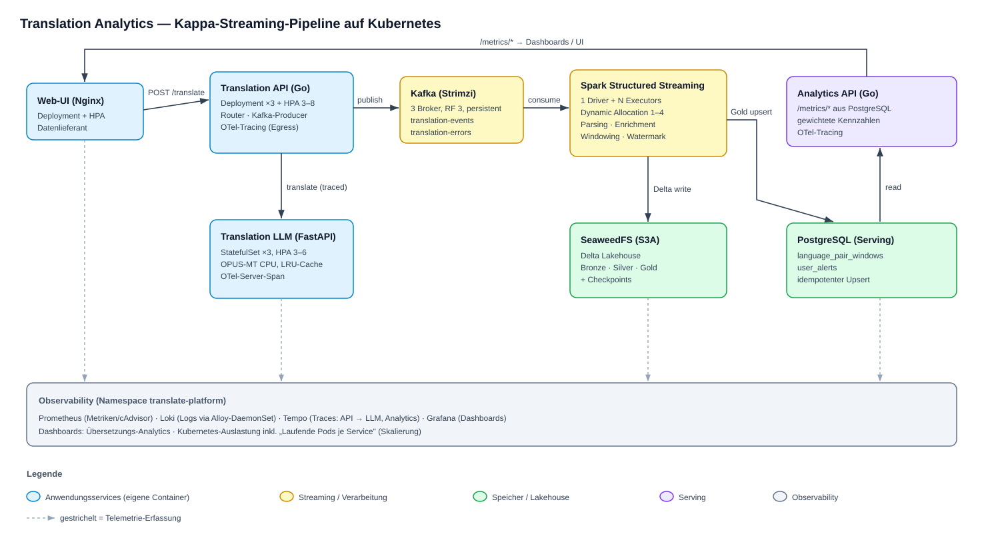

Im Streaming-Modus lesen Silver und Gold keine zuvor geschriebenen Delta-Tabellen. Sechs unabhängige Streaming Queries verwenden gemeinsame DataFrame-Definitionen und jeweils eigene Checkpoints. Bronze, Silver und Gold sind logische Qualitätsstufen, die parallel aus Kafka abgeleitet werden. PostgreSQL wird innerhalb des Gold-Callbacks nach dem Delta-Schreibversuch aktualisiert. Grafana liest im vorliegenden Stand direkte Betriebsmetriken, Logs und Traces.

## 4. Komponenten und Datenfluss

| Komponente | Implementierung, Technologiewahl und Verantwortung |
|---|---|
| Web-UI | [HTML/JavaScript und CSS](services/web-ui/) werden durch Nginx ausgeliefert. Eine einfache statische Oberfläche reicht zur Texteingabe, Sprachauswahl und Darstellung der Antwort aus. |
| Translation API | [Go-HTTP-Service](services/translation-api/main.go): validiert Eingaben, normalisiert einige Sprachaliase, ruft das Modellbackend auf und erzeugt Kafka-Events. Go bündelt Netzwerkzugriffe und parallele Anfragen in einer kleinen Gateway-Komponente. |
| Modellrouter | [Modellbewusster Load Balancer](services/translation-api/router.go): Ein Standard-LB würde Anfragen blind streuen und so jedes Modell potenziell auf jedem Pod laden. Das ist schlecht, weil Modelle bei kaltem Cache erst heruntergeladen werden müssen. Kernidee ist daher ein Hot/Cold-Split: häufige (`HOT_PAIRS`, überall vorgeladene) Paare werden für Durchsatz über alle Pods verteilt, seltene Paare per Consistent-Hashing stabil an wenige Pods gebunden, damit ihr Modell nur dort geladen werden muss. Feinauswahl jeweils über lokale In-flight-Zähler. |
| Translation LLM | [FastAPI/Transformers-Service](services/translation-llm/main.py): CPU-Inferenz mit Helsinki-NLP OPUS-MT, Satzsegmentierung, bedarfsgesteuertes Laden und LRU-Modellcache. Trotz Verzeichnisname ist dies ein spezialisierter Übersetzungsmodellservice. |
| Kafka / Strimzi | [Kafka- und Topic-Ressourcen](infra/kafka/kafka.yaml) entkoppeln Produzent und Analyse und erlauben partitionierten Konsum. Strimzi übernimmt den deklarativen Kafka-Betrieb. |
| Spark Structured Streaming | [PySpark-Job](services/spark-streaming-job/src/main.py) implementiert explizites Parsing, Anreicherung, Zeitfenster, Fehlerquoten und Nutzer-Burst-Erkennung. Dieselben DataFrame-Funktionen werden beim Wiederaufbau genutzt. |
| Delta Lake / SeaweedFS | [S3-kompatibler Speicher](infra/storage/seaweedfs/k8s/seaweedfs.yaml) hält die Delta-Tabellen und Checkpoints. S3A vermeidet eine HDFS-spezifische Kopplung des Verarbeitungscodes. |
| PostgreSQL | [Serving-Datenbank mit Initialschema](infra/postgres/k8s/postgresql.yaml) hält über Primärschlüssel aktualisierbare Ergebniszeilen. Dadurch muss eine HTTP-Abfrage nicht jedes Mal Dateien im Lake auswerten. |
| Analytics API | [Go/pgx-Service](services/analytics-api/main.go) liest Kennzahlen aus PostgreSQL und liefert JSON. Der Dienst liest Delta nicht direkt. |
| Observability | [Grafana, Prometheus, Loki, Tempo und Alloy](infra/observability/k8s/) dienen der Betriebsbeobachtung. Prometheus erfasst API-Zähler und cAdvisor-Daten, Alloy sammelt Pod-Logs, Tempo empfängt verteilte Traces. Translation API, Translation LLM und Analytics API sind OTel-instrumentiert. Ein `/translate`-Trace umfasst Gateway und Modellservice (verschachtelte Spans). |
| Infrastruktur | [Terraform](infra/terraform/) beschreibt OpenStack-VMs, [Ansible](infra/ansible/) installiert k3s und stellt Images und Manifeste bereit. Traefik, DNS/TLS und weitere Cluster-Add-ons stammen aus der externen Kursrolle. |

Der Ende-zu-Ende-Fluss einer Anfrage:

1. Der Browser sendet `POST /translate` mit `text`, `src_lang`, `tgt_lang` und `X-Source: web-ui` an seinen eigenen Host.
2. Der [UI-Ingress](services/web-ui/k8s/ingress.yaml) leitet diesen Pfad an die Translation API weiter. Die API wählt einen Modell-Pod und erhält die Übersetzung zurück.
3. Die API antwortet mit `translated`, `model`, `latency_ms` und `req_id`. Parallel versucht eine Goroutine, das Telemetrie-Event nach Kafka zu schreiben. Die HTTP-Antwort bestätigt deshalb noch keine erfolgreiche Speicherung des Events.
4. Spark liest beide in der [Spark-ConfigMap](services/spark-streaming-job/k8s/configmap.yaml) konfigurierten Topics, normalisiert das JSON und schreibt Bronze, gültiges Silver, ungültige Datensätze und drei Gold-Ausgaben in Delta.
5. Die Gold-Callbacks schreiben zusätzlich per SQL-Upsert nach PostgreSQL. Die Analytics API stellt daraus `/metrics/summary`, `/metrics/language-pairs`, `/metrics/latency`, `/metrics/errors` und `/metrics/timeseries` bereit.
6. Grafana bietet separat Betriebsinformationen aus Prometheus, Loki und Tempo an. Die Web-UI zeigt Übersetzungen und Modellzustand. User-Facing UI und Analytics sind damit klar getrennt.

## 5. Processing-Logik

### Parsing, Validierung und Anreicherung

[`EVENT_SCHEMA`](services/spark-streaming-job/src/main.py#L10) legt zwölf JSON-Felder fest. [`parse_kafka_events`](services/spark-streaming-job/src/main.py#L110) bewahrt zusätzlich Roh-JSON, Topic, Partition, Offset, Kafka-Zeit und Ingestionszeit. Sprachcodes und Status werden getrimmt und kleingeschrieben. `event_ts` wird in `event_time` umgewandelt. `effective_ts` nutzt bei einem fehlenden Eventzeitstempel die Ingestionszeit für die Ablagepartition. Ein ungültiger Eventzeitstempel bleibt trotzdem ein Validierungsfehler.

[`with_validation`](services/spark-streaming-job/src/main.py#L163) prüft Request-ID, Eventzeit, Nutzerhash, Sprachcode-Muster, Status und eine nicht negative Zeichenzahl. Ungültige Datensätze erhalten ein Feld `validation_errors`. Zwei statische Left Joins ergänzen Namen, Schriftsystem und Sprachfamilie für Quell- und Zielsprache. Die Referenzdatei wird zu Beginn geladen. Es handelt sich dabei um Stream-Static-Joins und keine zeitabhängigen Stream-Stream-Joins.

Die Validierung ist NULL-sicher: Für `src_lang`, `tgt_lang` und `status` wird `col.isNull()` explizit mit den Muster-/Mengenprüfungen kombiniert, sodass ein Event mit `src_lang=null` etc. nicht mehr fälschlich als gültig durchrutscht (die negierten Ausdrücke allein ergeben bei NULL nicht TRUE). Negative Gesamt-Latenzen (`latency_ms_total`) werden zusätzlich als `invalid_latency` markiert. Verbleibende Grenzen: `latency_ms_translate` wird nicht separat geprüft, ein unbekannter Referenz-Sprachcode wird durch den Left Join nicht verworfen (er erhält NULL-Metadaten), und eine Event-Deduplizierung ist bewusst nicht implementiert.

### Nicht-triviale Transformationen

| Ausgabe | Gruppierung und Fenster | Ergebnis |
|---|---|---|
| Gold 1m | Sprachpaar, nicht überlappendes Eventzeitfenster von einer Minute | Anzahl, mittlere Gesamt-/Backendlatenz, Fehlerzahl, Fehlerquote, approximatives p95 der Gesamtlatenz |
| Gold 5m | Sprachpaar, fünf Minuten Fensterbreite mit einer Minute Verschiebung | Dieselben Kennzahlen; ein Event gehört zu fünf überlappenden Fenstern |
| User Alerts | Nutzerhash, nicht überlappendes Fünf-Minuten-Fenster | Ab 20 Requests: Anzahl, approximative Anzahl verschiedener Sprachpaare und `many_requests_per_user_5m` |

Die Sprachpaar-Aggregation steht in [`language_pair_agg`](services/spark-streaming-job/src/main.py#L215), die Burst-Erkennung in [`user_alerts`](services/spark-streaming-job/src/main.py#L238). `error_rate = error_count / request_count`. Fenster sind halboffen: `[window_start, window_end)`.

Ein Backendfehler mit vollständigen Feldern ist ein gültiges Silver-Event und erhöht die Gold-Fehlerquote. Ein Ereignis ohne gültige Sprachcodes landet dagegen im Invalid-Bereich. Die Gold-Kennzahlen beziehen sich somit auf gültige, im jeweiligen Fenster berücksichtigte Ereignisse. Die direkt in der API erfassten Prometheus-Zähler können davon abweichen. Überlappende 5m-Fenster dürfen nicht zu einer Gesamtzahl unabhängiger Requests aufsummiert werden; die Analytics API verwendet dafür die 1m-Fenster.

### State, Watermark und Late Data

Die Aggregationen halten Zustand pro Schlüssel und Fenster. Im Streaming-Modus wird eine Watermark von 30 Sekunden auf `event_time` gesetzt. Sie orientiert sich am Fortschritt der beobachteten Eventzeit. Innerhalb der tolerierten Verspätung können Fenster korrigiert werden. Wesentlich spätere Ereignisse sind für bereits abgeräumten Aggregationszustand nicht zuverlässig berücksichtigt.

Bronze und Silver verwenden selbst keine Watermarks und können solche Ereignisse weiterhin enthalten. Eine separate Zählung oder Ablage ausschließlich zu später Events ist nicht implementiert. Das Replay aus Bronze berechnet ohne Streaming-Watermark. Deshalb kann ein Wiederaufbau mehr historische Ereignisse berücksichtigen als der Live-Aggregatzustand.

### Ausgabe- und Wiederholungssemantik

Bronze, Silver und Invalid werden im Append-Modus mit getrennten Checkpoints geschrieben. Gold nutzt `outputMode("update")` und `foreachBatch`: Geänderte Fensterstände werden alle 15 Sekunden zum Schreiben angeboten. Der Delta-Callback schreibt sie per idempotentem `MERGE` auf den fachlichen Fensterschlüssel (`window_start, window_end, language_pair` bzw. `user_id_hashed`). PostgreSQL erhält denselben Stand per `ON CONFLICT`-Upsert. Beim ersten Schreiben legt der Callback die Delta-Tabelle an, danach ersetzt der MERGE die betroffene Fensterzeile.

Folge: In Gold steht pro Fenster genau eine aktuelle Zeile, der Gold-Pfad ist also idempotent. Eine Exactly-once-Garantie über die gesamte Kette wird dagegen nicht beansprucht: Delta- und PostgreSQL-Schreibvorgang sind je für sich idempotent, aber nicht in einer gemeinsamen Transaktion gekoppelt, und Events werden nicht per `req_id` dedupliziert.

Der Kafka-Produzent nutzt `req_id` als Partitionsschlüssel und `RequiredAcks=RequireOne`, bestätigt also nur die Annahme durch den Leader. Die Broker-Einstellung `min.insync.replicas=2` erzwingt bei dieser Producer-Konfiguration keine Bestätigung durch mehrere Replikate. Beim Neustart setzen die Streaming Queries ihre jeweiligen Offsets und Zustände aus den Checkpoints fort. `startingOffsets=earliest` greift beim Start ohne vorhandenen Checkpoint; `failOnDataLoss=false` erlaubt die Fortsetzung, wenn Kafka-Offsets nicht mehr verfügbar sind. Checkpoints und Bronze-Archiv erfüllen daher unterschiedliche Aufgaben: Wiederaufnahme der laufenden Verarbeitung und spätere Neuberechnung historischer Daten.

Die Live-Kennzahlen der [Analytics-Summary](services/analytics-api/main.go) werden aus den materialisierten 1m-Fenstern mit einem Fensterstart innerhalb der letzten 60 Minuten in `language_pair_windows` abgeleitet: `total_requests` summiert alle 1m-Fenster des Zeitraums, `requests_per_minute` ist das jüngste Fenster, und Latenzen werden nach `request_count` gewichtet (`SUM(avg·count)/SUM(count)`) statt als ungewichteter Mittelwert von Fenstermittelwerten.

## 6. Speicherkonzept

Delta Lake kombiniert spaltenorientierte Parquet-Daten mit einem Transaktionslog unter `_delta_log`. Das ermöglicht strukturierte Tabellen auf Objektspeicher. Bronze erhält die Rohdaten für eine spätere Neuinterpretation, Silver vereinheitlicht sie, Gold reduziert sie auf Analysekennzahlen. Die aktuelle Implementierung hat allerdings keine tabellenübergreifende Transaktion und keine vollständig definierte Gold-Snapshot-Semantik.

| Schicht / S3A-Pfad | Partitionen | Inhalt und Begründung |
|---|---|---|
| `translation-bronze/events` | `date`, `hour` | Roh-JSON, Kafka-Metadaten und geparste Felder; zeitliche Eingrenzung bei Fehlersuche und Wiederaufbau |
| `translation-silver/events` | `date`, `language_pair` | Gültig eingestufte, normalisierte und angereicherte Events; passend zur Analyse je Tag und Sprachpaar |
| `translation-silver/invalid-events` | `date` | Fehlerhafte Events samt Validierungsgründen; tageweise Qualitätsanalyse |
| `translation-gold/language-pair-1m` | `date` | Minutenstände pro Sprachpaar; zeitliche Abfragen ohne Partition je einzelner Minute |
| `translation-gold/language-pair-5m` | `date` | Überlappende Fünf-Minuten-Stände |
| `translation-gold/user-alerts` | `date` | Auffälligkeiten je Nutzerhash/Fenster |
| `translation-checkpoints/spark-streaming-job` | Unterordner je Query | Offsets, Commit-/State-Informationen zur Wiederaufnahme; keine zusätzliche fachliche Tabelle |

Die Partitionierung ist ein Kompromiss: Zeitfilter können Dateimengen reduzieren, hohe Kardinalität der Sprachpaare und kurze Micro-Batches können aber viele kleine Dateien erzeugen.

Das Event-Schema im Überblick:

| Felder | Spark-Typ | Bedeutung |
|---|---|---|
| `req_id`, `src`, `user_id_hashed` | String | Request-Korrelation, Erzeuger und SHA-256 der Nutzerkennung. Die Nutzerkennung ist kein Login, sondern ein optionaler, vom Client gesetzter `X-User-ID`-Header; fehlt er, greift der Default `demo-user`. |
| `src_lang`, `tgt_lang`, `model`, `status` | String | Sprachpaar, optionaler Modellname und Erfolgs-/Fehlerstatus |
| `char_count` | Integer | Unicode-Codepoints des Eingabetexts |
| `latency_ms_total`, `latency_ms_translate` | Long | Dauer bis zur Eventerzeugung bzw. Dauer des Backendaufrufs in Millisekunden; kein Maß für die anschließende Pipeline-Latenz |
| `event_ts`, `error_type` | String | UTC-Zeitstempel bei Eventerzeugung und optionaler Fehlertyp |

Alle Felder sind im Parser technisch nullable. Eine Schema-Version und explizite Regeln zur Schema-Evolution werden nicht eingesetzt.

Das explizite Schema vereinheitlicht Datentypen für Validierung und Aggregation. Bronze bewahrt zusätzlich das Roh-JSON für eine spätere Neuinterpretation. Der Lakehouse-Ansatz trennt damit die detaillierte Historie von der auf schnelle Abfragen ausgelegten Serving-Datenbank. Die Kafka-Retention begrenzt die dort verfügbare Historie, während im Lake derzeit keine automatische Lösch- oder Kompaktierungsstrategie eingerichtet ist.

Die PostgreSQL-Tabellen `language_pair_windows` und `user_alerts` besitzen zusammengesetzte Primärschlüssel aus Fenstern und fachlichem Schlüssel. Das Serving ist damit auf die letzte per Upsert geschriebene Zeile je Fenster ausgelegt. Die im Initialschema vorhandene Tabelle `global_live_metrics` wird nicht mehr beschrieben oder gelesen. Die Live-Summary aggregiert stattdessen direkt `language_pair_windows`, sodass alle gespeicherten Fenster des Abfragezeitraums berücksichtigt werden. `requests_per_minute` bezeichnet das jüngste vorhandene Minutenfenster innerhalb der letzten Stunde und bleibt im Leerlauf erhalten, bis dieses aus dem Abfragezeitraum fällt. Das Initialschema wird nur beim ersten Start mit leerem Datenverzeichnis angewendet.

SeaweedFS Master, Volume und Filer besitzen eigene PVCs. Kafka läuft mit drei Brokern, Replikationsfaktor 3 und `min.insync.replicas=2` auf persistenten 10-GiB-Claims (`type: persistent-claim`, `deleteClaim: false`). Die Broker-Daten bleiben bei einem Pod-Ersatz auf den PVCs erhalten; die konfigurierte Topic-Retention beträgt sieben Tage. Die In-Cluster-Registry besitzt keinen PVC.

## 7. User-facing UI

Die UI erfüllt die Rolle Datenlieferant und zeigt zusätzlich die synchrone Übersetzungsantwort und Modellzustände.

Bedienablauf nach erfolgreichem Deployment:

1. `https://web-ui.${ZONE}` im Browser öffnen.
2. Quell- und Zielsprache auswählen. Für eine schnelle Demonstration eignen sich die im Manifest vorgeladenen Paare Deutsch-Englisch bzw. Englisch-Deutsch. Andere Sprachpaare müssen bei Bedarf heruntergeladen werden.
3. Einen Text eingeben und Übersetzen wählen.
4. Nach Abschluss erscheinen die Übersetzung und die zugehörige `req_id`. Ein Backend- oder Validierungsfehler wird im Statusbereich angezeigt.
5. Die Modellanzeige zeigt geladene bzw. ladende Paare. Der modellbezogene Status wird über `/loaded-pairs` abgefragt.
6. Die Request-ID ermöglicht die Zuordnung zum Kafka-/Bronze-Event. Die aggregierten Ergebnisse lassen sich anschließend über Sprachpaar und Eventzeitfenster in Gold und der Analytics API abfragen.

[`index.html`](services/web-ui/index.html#L343) verwendet echte `fetch`-Aufrufe. Die lokale Sprachliste ist eine feste Konfiguration. Das [Nginx-Image](services/web-ui/Dockerfile), [Deployment](services/web-ui/k8s/deployment.yaml), [Service](services/web-ui/k8s/service.yaml) und [Ingress](services/web-ui/k8s/ingress.yaml) bilden die eigenständige UI-Komponente ab. Der Ingress routet `/translate` und `/loaded-pairs` zur API und `/` zur UI. `/languages` ist als Exact-Pfad definiert, sodass die Datei `/languages.json` weiterhin von Nginx ausgeliefert werden kann.

Es gibt keinen Login: Die einzige Quelle einer Nutzerkennung ist der optionale HTTP-Header `X-User-ID`, den die API SHA-256-hasht. Der Browser sendet ihn derzeit nicht, daher fallen alle UI-Anfragen auf den Default `demo-user` zusammen und die Burst-Erkennung differenziert reale Browsernutzer noch nicht. Sie greift nur, wenn ein API-Client bewusst unterschiedliche `X-User-ID`-Werte setzt.

## 8. Kubernetes-Deployment

Die Anwendung wird durch Raw Manifests deklarativ beschrieben. Ansible ersetzt Domain-Platzhalter und wendet diese an. Ein Helm-Chart der Anwendung ist im Repository nicht vorhanden. Die Deployment-Quelle sind die `k8s/*.yaml`-Dateien.

| Komponente | Workload / Namespace / Replikate | Persistenz, Konfiguration und Skalierung (mit Nachweis) |
|---|---|---|
| Translation API | Deployment, `default`, 3; HPA 3-8 | Zustandsarme Requestbearbeitung, Headless-DNS-Router; HPA-Ziel 70 % der angeforderten CPU. Lasttest: blieb auf 3 (CPU max 21 %), weil das Gateway I/O-gebunden auf das LLM-Backend wartet. CPU ist hier ein schwaches Signal. Router-Zähler sind pro API-Pod lokal. |
| Translation LLM | StatefulSet, `default`, 3; HPA 3-6 | Je Pod 10-GiB-Cache-PVC; PRELOAD_PAIRS/MAX_MODELS als `env`. Lasttest: skalierte 3->6 (CPU-Sättigung durch Inferenz); bei einem neuen Cache-PVC werden Hot Pairs beim Start vorgeladen und weitere Modelle bei Bedarf geladen. |
| Web-UI | Deployment, `default`; HPA 2-5 | Statische Dateien im Image, hinter einem Service repliziert. Lasttest: blieb auf 2 (CPU max 60 %). Statisches Serving sättigt die CPU-Schwelle kaum. |
| Analytics API | Deployment, `default`; HPA 2-5 | Zustandsarme Leser; DB-Zugang aus Secret. Lasttest: skalierte 2->4 (DB-Query pro Request, CPU max 119 %). |
| Spark | Deployment (1 Driver), `default`; Dynamic Allocation 1-4 Executor-Pods | k3s-Client-Mode (`spark.master=k8s://…`), eigenes RBAC ([rbac.yaml](services/spark-streaming-job/k8s/rbac.yaml)); der Driver bleibt bewusst Singleton (ein Streaming-Query = ein Driver, `strategy: Recreate` gegen Rollout-Overlap), skaliert wird über Executors. Lasttest: Executors 1->4 unter Last, danach per Idle-Timeout zurück. |
| Kafka | Kafka/KafkaNodePool durch Strimzi, `default`, 3 Broker/Controller | Zwei Topics mit je 3 Partitionen, Replikationsfaktor 3, `min.insync.replicas=2`, persistente 10-GiB-Claims. Mehr Partitionen/Broker für höhere Konsumparallelität konzeptionell möglich. |
| PostgreSQL | StatefulSet, `default`, 1 | 5-GiB-PVC, Initialschema in ConfigMap, Zugang im Secret. Ein einzelner Schreib-Knoten. |
| SeaweedFS | Drei StatefulSets, `seaweedfs`, je 1 | Master 1 GiB, Volume 20 GiB, Filer 2 GiB; Bucket-Init als Job. Volume-Pods erweitern Kapazität. |
| Grafana | Deployment, `translate-platform`, 1 | 2-GiB-PVC; Datasources und Dashboards in ConfigMaps; Adminzugang aus Secret. |
| Prometheus / Loki / Tempo | Je Deployment, `translate-platform`, je 1 | Je 5-GiB-PVC, lokale Eininstanz-Speicher. Verteilter Betrieb hier nicht konfiguriert (Support-Komponenten). |
| Alloy | DaemonSet, `translate-platform` | Ein Collector je Node, skaliert prinzipbedingt mit der Node-Zahl. |
| Registry | Deployment aus Ansible, `default`, 1 | Keine konfigurierte Persistenz; Imageverlust bei Pod-Ersatz möglich; Ersatz für Docker-Registry. |

Die Anwendungsdienste verwenden vier CPU-basierte HPAs (Translation API, Translation LLM, Web-UI und Analytics API); Spark passt die Zahl seiner Executors über Dynamic Allocation an. Der [Grafana-Verlauf](images/k8s-scaling-2.png) zeigt für Translation LLM 3->6->3 und für Analytics API 2->4->2 Pods. Damit sind Hoch- und Rückskalierung unter Last dokumentiert. Die [HPA-Protokolle](docs/evidence/) ergänzen den Bildnachweis. Web-UI und Translation API bleiben im Test am Minimum, da ihre CPU-Auslastung die Zielschwelle von 70 % der angeforderten CPU nicht überschreitet. Metrics-Server liefert die HPA-Metriken. Mindestens zwei Replikate erhöhen die Verfügbarkeit von Web-UI und Analytics API; die Ausfallsicherheit hängt zusätzlich von Pod-Verteilung und Infrastruktur ab.

Spark verteilt die Verarbeitung auf Executor-Pods, während ein Driver die sechs Streaming Queries koordiniert. Kafka verarbeitet die Ereignisse bereits auf drei Brokern mit partitionierten Topics. PostgreSQL und die Speicher-/Observability-Dienste laufen in der vorliegenden Konfiguration als Einzelinstanzen. Ihre Erweiterung erfordert eine abgestimmte Replikations- bzw. Speicherarchitektur und ist in [Abschnitt 12](#12-grenzen-des-prototyps-eigenanteil-und-ausblick) eingeordnet.


Die StorageClass ist in den PVCs nicht angegeben. Der Cluster stellt eine Default-StorageClass bereit (im Testcluster Longhorn). Strimzi und die externe Kursrolle erzeugen weitere Operator-/Clusterressourcen, deren genaue Versionen im Projekt nicht vollständig festgeschrieben sind.

## 9. Deployment-Anleitung

### Voraussetzungen und Geltungsbereich

Der vorhandene Weg setzt eine DHBW-OpenStack-Umgebung mit VPN-/Netzerreichbarkeit, SSH-Keypair, passender DNS-Zone und TSIG-Daten voraus. Terraform erstellt standardmäßig einen Server und zwei Worker. Die konkreten Image-/Flavor-/Netz-IDs aus [variables.tf](infra/terraform/variables.tf) müssen im jeweiligen Projekt existieren. Es werden Terraform, Ansible, Python 3 mit `kubernetes` und `PyYAML`, die Collection `kubernetes.core`, `kubectl`, Podman und Git benötigt. Für die Container sind Paket-, Image-, Maven- und Modell-Downloads erforderlich.

Der Cluster braucht Traefik, DNS/TLS-Konfiguration, eine Default-StorageClass, ausreichend RAM/CPU/Disk und für den HPA die Metrics API. Allein die drei Modell-Pods fordern zusammen 4.500 MiB RAM an. Die externe [Kursrolle](https://github.com/pfisterer/k3s-dhbw-cloud-role) liefert die k3s-/DNS-/TLS-Grundlage.

Die folgenden Befehle beschreiben den vorhandenen Deploy-Weg. Er wurde für den dokumentierten Stand vollständig auf einem frisch provisionierten Cluster ausgeführt (Terraform -> k3s -> Images -> Plattform), und alle Services inklusive der Streaming-Pipeline liefen anschließend end-to-end. Der Manifest-Applyer schreibt Ressourcen ohne eigenen `metadata.namespace` explizit in `default`, Voraussetzung ist die Python-Lib `kubernetes` im Ansible-Interpreter. Einige externe Bestandteile sind festgeschrieben (Observability-Images per Digest, Strimzi 1.2.0, Terraform-Provider samt eingechecktem Lock, Ansible-Rolle auf Commit und `kubernetes.core` 6.5.0). Nicht identisch bleiben die aus dem Quellcode neu gebauten eigenen `:latest`-Service-Images, einzelne Container-Base-Images mit Tags sowie die zur Laufzeit von Hugging Face geladenen Modellgewichte und der UI-Sprachkatalog.

### 9.1 Lokale Konfiguration

Alle Pfade beginnen am Repository-Root; `PROJECT_ROOT` wird durch das Hilfsskript gesetzt.

```bash
cp .env.example .env
# STUDENT_ID in .env auf die eigene Kennung setzen.
source scripts/load-env.sh
export REGISTRY_HOST="$REGISTRY"

# Optional mit direnv, damit die Variablen automatisch geladen werden
cp .envrc.example .envrc
direnv allow

ansible-galaxy install -r infra/ansible/requirements.yaml
# Im von Ansible verwendeten Python müssen kubernetes und PyYAML installiert sein.
```

`REGISTRY_HOST` wird von den Ansible-Builds verwendet, das [Hilfsskript](scripts/load-env.sh) exportiert `REGISTRY`. Für den aktuellen Manifest-Renderer muss die Registry unter `registry.${ZONE}` liegen: Eine beliebig andere Registry-Adresse wird beim Rendern nicht aus `REGISTRY_HOST` übernommen.

### 9.2 VMs und k3s bereitstellen

```bash
cp infra/terraform/terraform.tfvars.example infra/terraform/terraform.tfvars
# OpenStack-Zugang, SSH-Keypair, vm_prefix und nötige Ressourcenwerte eintragen.
terraform -chdir=infra/terraform init
terraform -chdir=infra/terraform plan
terraform -chdir=infra/terraform apply

cp infra/ansible/dns-credentials.yaml.example infra/ansible/dns-credentials.yaml
# DNS-Zone, TSIG, E-Mail und kubeconfig_path eintragen.
# kubeconfig_path auf einen absoluten lokalen Zielpfad setzen,
# z. B. <Repository>/infra/ansible/kubeconfig-generated.yaml.

cd "$PROJECT_ROOT/infra/ansible"
ansible-playbook \
  -i ../terraform/generated-inventory.yml \
  -i dns-credentials.yaml \
  --private-key "$HOME/.ssh/id_ed25519_cloud" \
  deploy.yaml

cd "$PROJECT_ROOT"
export KUBECONFIG="$PROJECT_ROOT/infra/ansible/kubeconfig-generated.yaml"
kubectl get nodes
kubectl get storageclass
```

Der private Schlüsselpfad ist an die eigene Umgebung anzupassen. Die expliziten Inventory-Argumente vermeiden die Abhängigkeit von einer lokal vorhandenen `ansible.cfg`. Wenn bereits ein Cluster läuft, kann dieser Abschnitt (VMs und k3s) übersprungen werden; es müssen dann nur die Voraussetzungen aus 9.1 sowie `KUBECONFIG`, `ZONE` und `REGISTRY_HOST` gesetzt sein, bevor es mit 9.3 weitergeht.

### 9.3 Images und Plattform bereitstellen

```bash
cd "$PROJECT_ROOT"
ansible-playbook infra/ansible/playbooks/05-deploy-full.yaml
```

Das Sammelplaybook [05-deploy-full.yaml](infra/ansible/playbooks/05-deploy-full.yaml) setzt einen bereits vorhandenen k3s-Cluster voraus und führt nacheinander [02-build-images.yaml](infra/ansible/playbooks/02-build-images.yaml), [03-install-strimzi.yaml](infra/ansible/playbooks/03-install-strimzi.yaml) und [04-deploy-platform.yaml](infra/ansible/playbooks/04-deploy-platform.yaml) aus. Es baut fünf Images mit Podman, veröffentlicht sie in der In-Cluster-Registry, installiert Strimzi und wendet SeaweedFS, Kafka, PostgreSQL, Anwendungsservices sowie Observability an. Domain-Platzhalter werden im Arbeitsspeicher ersetzt. Ein direktes `kubectl apply` auf die unveränderten UI-/API-Manifeste würde noch die Platzhalter verwenden.

Für reine Manifeständerungen ohne Image-Build kann [04-deploy-platform.yaml](infra/ansible/playbooks/04-deploy-platform.yaml) separat ausgeführt werden. Dieses Playbook wendet die Plattform in Abhängigkeitsreihenfolge an, baut aber keine Images und erzwingt keinen Rollout-Restart aller Services.

Die fünf eigenen Service-Images werden als `:latest` gebaut und referenziert. Ein erneuter kompletter Build/Apply startet unveränderte Pod-Templates nicht zwingend neu. Für ein aufwandsarmes Service-Update gibt es deshalb einzelne Build-and-Deploy-Playbooks. Sie bauen nur das jeweilige Image, pushen es, wenden dessen Manifeste an, starten den passenden Rollout neu und warten auf den Abschluss:

| Service | Playbook |
|---|---|
| Translation API | [10-build-and-deploy-translation-api.yaml](infra/ansible/playbooks/10-build-and-deploy-translation-api.yaml) |
| Translation LLM | [11-build-and-deploy-translation-llm.yaml](infra/ansible/playbooks/11-build-and-deploy-translation-llm.yaml) |
| Web-UI | [12-build-and-deploy-web-ui.yaml](infra/ansible/playbooks/12-build-and-deploy-web-ui.yaml) |
| Analytics API | [13-build-and-deploy-analytics-api.yaml](infra/ansible/playbooks/13-build-and-deploy-analytics-api.yaml) |
| Spark Streaming Job | [15-build-and-deploy-spark-streaming-job.yaml](infra/ansible/playbooks/15-build-and-deploy-spark-streaming-job.yaml) |

Beispiel:

```bash
cd "$PROJECT_ROOT"
ansible-playbook infra/ansible/playbooks/10-build-and-deploy-translation-api.yaml
ansible-playbook infra/ansible/playbooks/11-build-and-deploy-translation-llm.yaml
ansible-playbook infra/ansible/playbooks/12-build-and-deploy-web-ui.yaml
ansible-playbook infra/ansible/playbooks/13-build-and-deploy-analytics-api.yaml
ansible-playbook infra/ansible/playbooks/15-build-and-deploy-spark-streaming-job.yaml
```

### 9.4 Bereitschaft und Zugriff prüfen

Das Plattformplaybook wartet bisher nur auf Modellservice, Translation API und UI. Für eine vollständige Kontrolle sind zusätzlich die Infrastruktur und Analytics zu prüfen:

```bash
kubectl -n seaweedfs rollout status statefulset/seaweedfs-master --timeout=300s
kubectl -n seaweedfs rollout status statefulset/seaweedfs-volume --timeout=300s
kubectl -n seaweedfs rollout status statefulset/seaweedfs-filer --timeout=300s
kubectl -n seaweedfs wait --for=condition=complete job/seaweedfs-bucket-init --timeout=300s
kubectl -n default wait kafka/translation-kafka --for=condition=Ready --timeout=600s
kubectl -n default rollout status statefulset/analytics-db --timeout=300s
kubectl -n default rollout status deployment/analytics-api --timeout=300s
kubectl -n default rollout status deployment/spark-streaming-job --timeout=300s
kubectl -n default logs deployment/spark-streaming-job --tail=100
kubectl -n default get hpa
kubectl get pods,pvc -A
```

Ein erfolgreicher Spark-Rollout allein bestätigt keine verarbeitenden Queries, dafür sind Fortschrittsdaten und Ausgaben nach [Abschnitt 11](#11-screenshots-und-nachweise) nötig. Eine Startreihenfolge beim Anwenden ersetzt kein Warten auf Bereitschaft. Bei Startfehlern zuerst Logs, Bucket-Init, Kafka und DB prüfen.

| Zugriff | Ziel |
|---|---|
| `https://web-ui.${ZONE}` | Übersetzungsoberfläche |
| `https://translation-api.${ZONE}/health` | Gateway-Health |
| `https://analytics-api.${ZONE}/metrics/language-pairs` | PostgreSQL-basierter Serving-Output |
| `https://analytics-ui.${ZONE}` | Grafana-Betriebsdashboards |

Die Hostnamen werden durch `ZONE` konkretisiert. TLS setzt die funktionierende Wildcard-Zertifikatkonfiguration voraus. Grafana-Zugang stammt aus `grafana-admin-credentials`. Der optionale S3-Schreib-/Lesetest liegt unter [infra/storage/seaweedfs/smoke-test.sh](infra/storage/seaweedfs/smoke-test.sh).

Festgelegt sind Observability-Images per Digest, Strimzi 1.2.0, Terraform-Provider (local 2.9.0 / openstack 3.4.0 samt eingechecktem Lock), die Ansible-Rolle per Commit und `kubernetes.core` 6.5.0. Andere Container-Images verwenden Tags, etwa `python:3.12-slim`, `postgres:16-alpine` und `registry:2`; diese können auf aktualisierte Image-Inhalte verweisen. Verbleibende Reproduzierbarkeitsgrenzen: die aus dem Quellcode gebauten eigenen `:latest`-Service-Images, die zur Laufzeit aus Maven Central aufgelösten (versions-gepinnten) Spark-Connector-JARs, dynamische Modellgewicht-/Sprachkatalog-Downloads von Hugging Face sowie fehlende Registry-Persistenz. Die vorhandenen Secrets enthalten Demo-Vorgaben und müssen für eine eigene Umgebung konsistent ersetzt werden.

### 9.5 Übersetzung und Analyse abfragen

Nach dem Deployment erzeugt eine Übersetzungsanfrage ein neues Telemetrie-Ereignis. Die zurückgelieferte Request-ID dient zur Zuordnung zur Anfrage; die Analytics API liefert die nachfolgend von Spark materialisierten Fenster:

```bash
curl --fail-with-body --max-time 150 \
  "https://translation-api.${ZONE}/translate" \
  -H 'Content-Type: application/json' \
  -H 'X-Source: readme-example' \
  -H 'X-User-ID: example-user' \
  --data '{"text":"Guten Morgen","src_lang":"de","tgt_lang":"en"}'

curl --fail "https://analytics-api.${ZONE}/ready"
curl --fail "https://analytics-api.${ZONE}/metrics/summary"
curl --fail "https://analytics-api.${ZONE}/metrics/language-pairs?limit=100"
curl --fail "https://analytics-api.${ZONE}/metrics/timeseries"
```

Die asynchrone Verarbeitung kann beim ersten Abruf noch laufen; die Analytics-Abfrage wird dann nach Abschluss des Micro-Batches wiederholt. Alle Kennzahlen verwenden Fensterstarts innerhalb der letzten Stunde. `/metrics/language-pairs` liefert standardmäßig höchstens zehn Paare und unterstützt `limit` von 1 bis 100. Zeitreihen enthalten nur gespeicherte Fenster und füllen Minuten ohne Ereignisse nicht mit Nullzeilen auf. 5m-Fenster, p95 und Nutzer-Alerts werden gespeichert, sind aber über die aktuelle Analytics API nicht abrufbar. `/ready` der Analytics API prüft die Datenbankverbindung.

## 10. Wesentliche Codeabschnitte und Repository-Struktur

| Bereich | Zentraler Einstieg | Was dort passiert |
|---|---|---|
| Ingestion | [main.go, `handleTranslate`, Zeile 507](services/translation-api/main.go#L507) | Bearbeitet die Anfrage und erzeugt Erfolgs-/Fehlerereignisse. |
| Kafka-Produzent | [main.go, `newKafkaWriter`, Zeile 338](services/translation-api/main.go#L338) | Konfiguriert Hash-Verteilung, Zeitlimits und Kafka-Acknowledgements. |
| Veröffentlichung | [main.go, `publishAsync`, Zeile 711](services/translation-api/main.go#L711) | Sendet asynchron und protokolliert Publish-Fehler. |
| Routing | [router.go](services/translation-api/router.go) | Verbindet Consistent Hashing mit einer lastabhängigen Pod-Auswahl. |
| Inferenz | [main.py](services/translation-llm/main.py) | Lädt/cacht OPUS-MT und übersetzt satzweise. |
| Parsing/Qualität | [main.py, Zeilen 110 und 163](services/spark-streaming-job/src/main.py#L110) | Übernimmt Kafka-Metadaten und prüft die Felder. |
| Enrichment | [main.py, `silver_events`, Zeile 188](services/spark-streaming-job/src/main.py#L188) | Reichert beide Sprachen durch statische Joins an. |
| Aggregationen | [main.py, `language_pair_agg`, Zeile 215](services/spark-streaming-job/src/main.py#L215) | Berechnet Eventzeitfenster und Qualitäts-/Latenzkennzahlen. |
| Gold-Sinks | [main.py, `start_gold_stream`, Zeile 377](services/spark-streaming-job/src/main.py#L377) | Schreibt Fensterupdates idempotent per MERGE nach Delta und per Upsert nach PostgreSQL. |
| Query-Start/Replay | [main.py, Zeilen 405 und 436](services/spark-streaming-job/src/main.py#L405) | Startet sechs Queries bzw. den Bronze-Wiederaufbau. |
| Serving | [main.go, `routes`, Zeile 177](services/analytics-api/main.go#L177) | Registriert JSON-Endpunkte für Datenbankabfragen. |
| UI-Interaktion | [index.html, Zeile 343](services/web-ui/index.html#L343) | Sendet reale Übersetzungsanfragen mit `fetch`. |
| UI-Routing | [ingress.yaml](services/web-ui/k8s/ingress.yaml) | Ordnet Browserpfade den UI-/API-Services zu. |
| Konfiguration | [Spark-ConfigMap](services/spark-streaming-job/k8s/configmap.yaml) | Definiert Topics, S3-Pfade, Fensterparameter und Betriebsmodus. |
| Infrastruktur | [Kafka](infra/kafka/kafka.yaml), [SeaweedFS](infra/storage/seaweedfs/k8s/seaweedfs.yaml), [PostgreSQL](infra/postgres/k8s/postgresql.yaml) | Deklarieren Broker, Objektspeicher, Datenbank und Speicherbedarf. |
| Deployment | [05-deploy-full.yaml](infra/ansible/playbooks/05-deploy-full.yaml), [apply-manifests.yaml](infra/ansible/tasks/apply-manifests.yaml) | Bündeln Build/Deploy und ersetzen Domain-Platzhalter. |
| Tests | [main_test.go](services/analytics-api/main_test.go) | Prüft Analytics-HTTP-Handler mit einer simulierten Datenbank, ohne SQL-Semantik am echten Server zu verifizieren. |

Ordner: [services](services/) enthält die fünf eigenen Dienste, [infra](infra/) Infrastruktur und Manifeste, [scripts](scripts/) die gemeinsame Umgebungskonfiguration, [images](images/) das Architekturdiagramm und die Screenshots des laufenden Systems, [docs/evidence](docs/evidence/) die Lasttest-Rohprotokolle.

## 11. Screenshots und Nachweise

Die folgenden Screenshots zeigen das auf dem k3s-Cluster laufende System (aufgenommen am 9. September 2026). Die Bilddateien liegen in [`images/`](images/). Ergänzende Kommandozeilen-Belege des Lasttests (HPA-Zustände, Spark-Executor-Verlauf) liegen in [`docs/evidence/`](docs/evidence/).

### User-Facing UI im Betrieb

Bedienablauf der echten, an die Pipeline angebundenen Oberfläche: Sprachauswahl und Texteingabe, der einmalige Modell-Download beim ersten Aufruf eines Paars, bereits gecachte Modelle, und die zurückgelieferte Übersetzung.

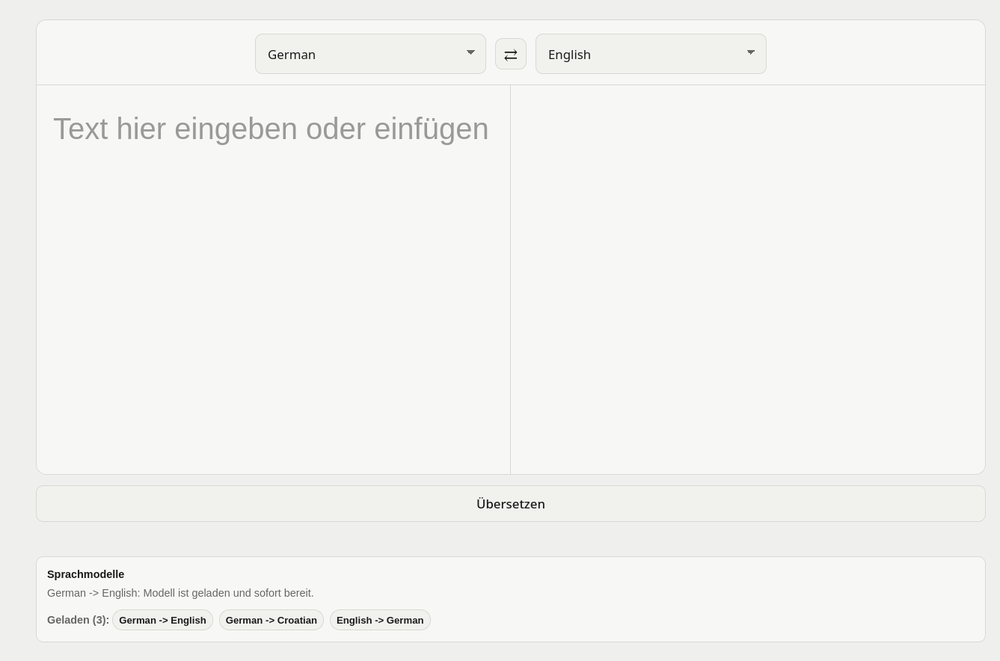
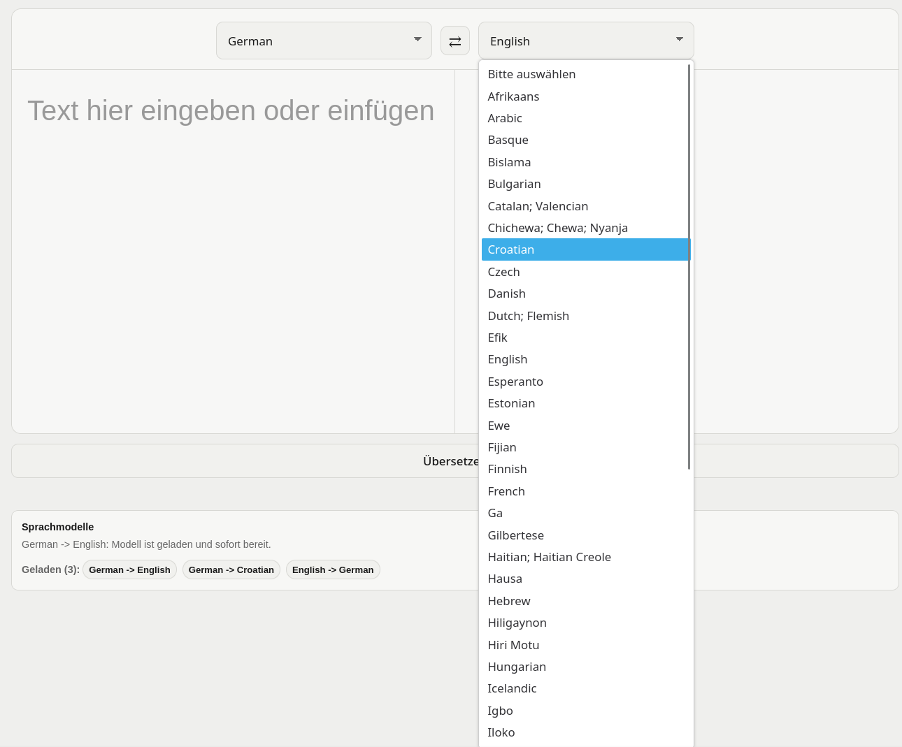
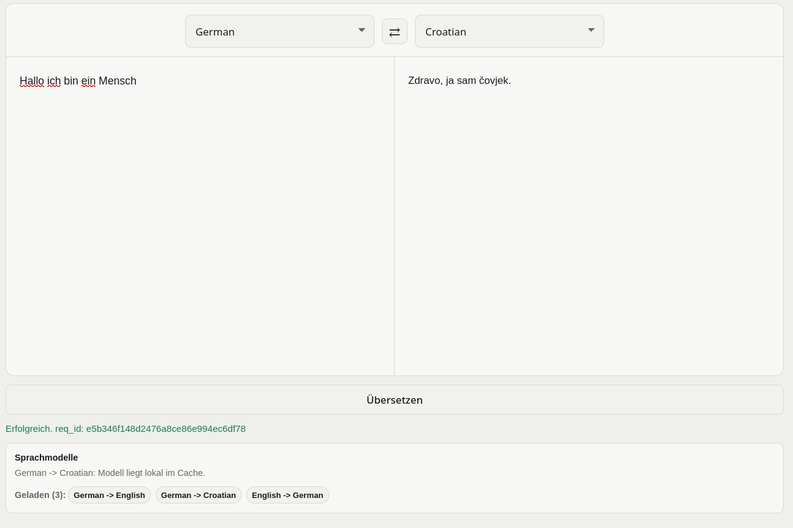
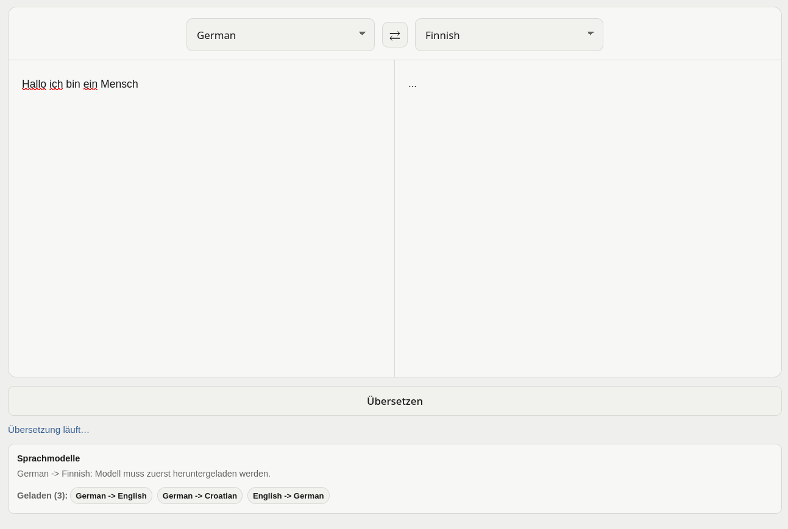
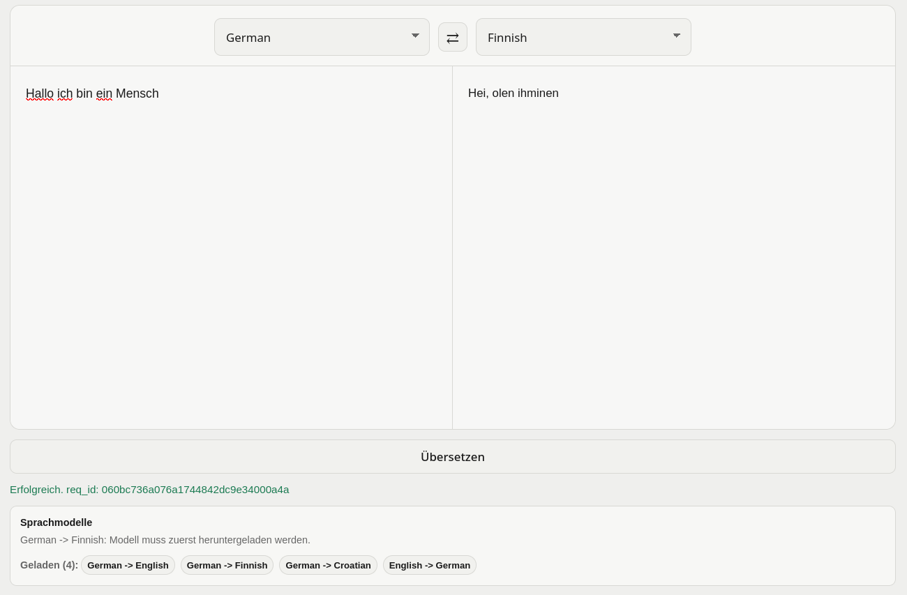

### Serving-Output (Analytics aus PostgreSQL)

Das [Translation-Analytics-Dashboard](infra/observability/k8s/dashboard-translation-analytics.yaml) visualisiert die von Prometheus erfassten Request-Zähler, Latenzen und Fehler der Translation API. Die von Spark nach PostgreSQL geschriebenen Gold-Kennzahlen stehen separat über die Analytics API zur Verfügung und sind in den folgenden Beispielausgaben dargestellt.

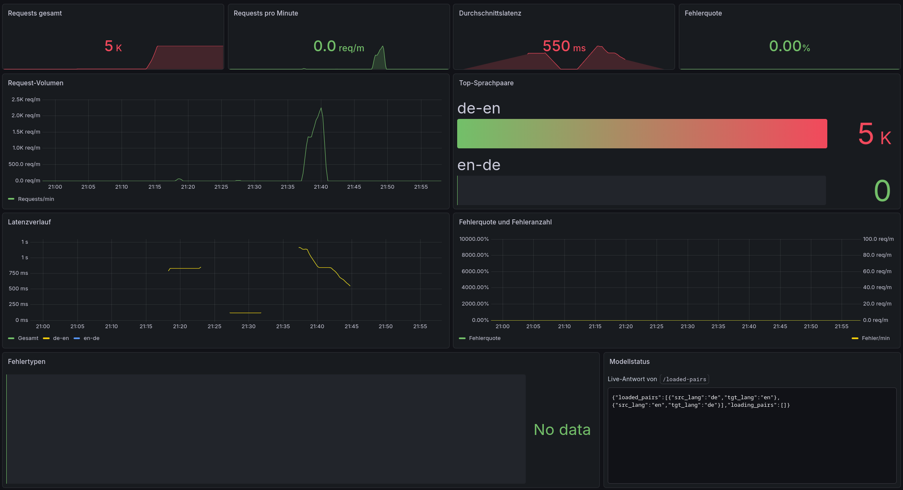

### Analytics-Beispieloutputs

Konsistente Momentaufnahme aller Analytics-Endpunkte nach echten Übersetzungen:

```jsonc
// GET /metrics/summary
{ "total_requests": 21, "requests_per_minute": 20, "avg_latency_ms": 1375.5, "error_rate": 0 }

// GET /metrics/language-pairs
[ { "language_pair": "de-en", "request_count": 15, "avg_latency_ms_total": 1346.8, "error_count": 0, "error_rate": 0 },
  { "language_pair": "en-de", "request_count": 6,  "avg_latency_ms_total": 1447.3, "error_count": 0, "error_rate": 0 } ]

// GET /metrics/timeseries   (Requests je 1-Minuten-Fenster)
[ { "window_start": "2026-09-09T22:38:00Z", "request_count": 1,  "avg_latency_ms_total": 100 },
  { "window_start": "2026-09-09T22:42:00Z", "request_count": 20, "avg_latency_ms_total": 1439.3 } ]

// GET /metrics/latency      (nach request_count gewichtete Latenz je Fenster)
[ { "window_start": "2026-09-09T22:38:00Z", "avg_latency_ms_total": 100 },
  { "window_start": "2026-09-09T22:42:00Z", "avg_latency_ms_total": 1439.3 } ]
```

Die Werte sind in sich stimmig: `total_requests` 21 = 1 + 20 über die beiden Fenster, `de-en` 15 + `en-de` 6 = 21. Die höhere Latenz (~1,4 s statt ~100 ms bei einer einzelnen warmen Anfrage) entsteht durch 20 **gleichzeitige** Anfragen an die CPU-Inferenz. `GET /metrics/errors` liefert dieselbe Fensterstruktur mit `error_count`/`error_rate` (hier 0, per `omitempty` weggelassen). Die Zuordnung erfolgt über Sprachpaar und UTC-Eventzeitfenster.

### Kubernetes-Cluster, Ressourcen und Autoskalierung

Node- und Pod-Auslastung sowie die eigens ergänzten Panels "Laufende Pods je Service", die das Hoch-/Runterskalieren sichtbar machen.

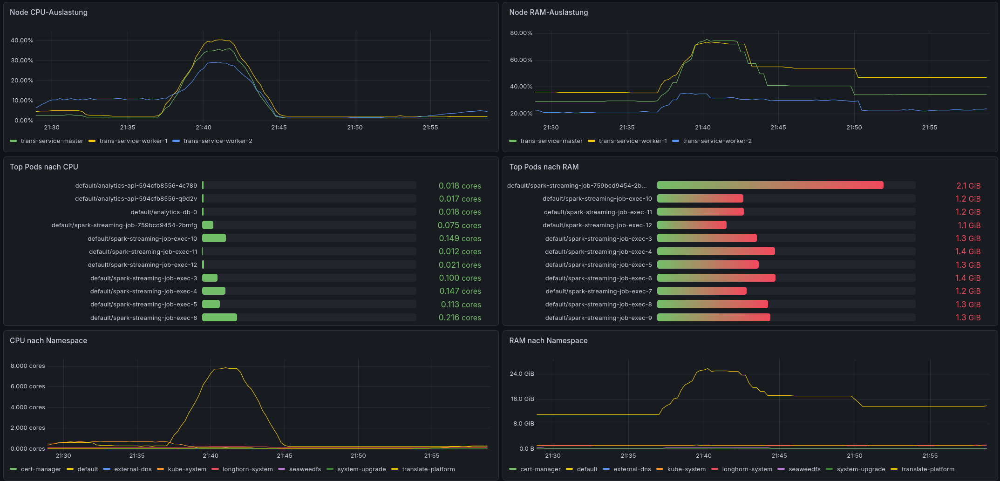
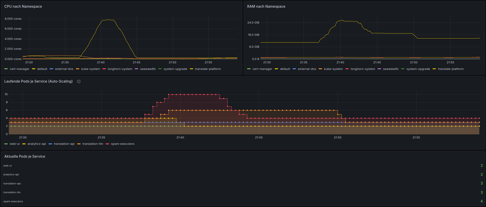
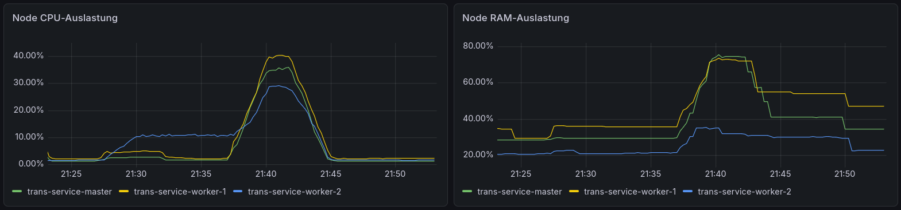
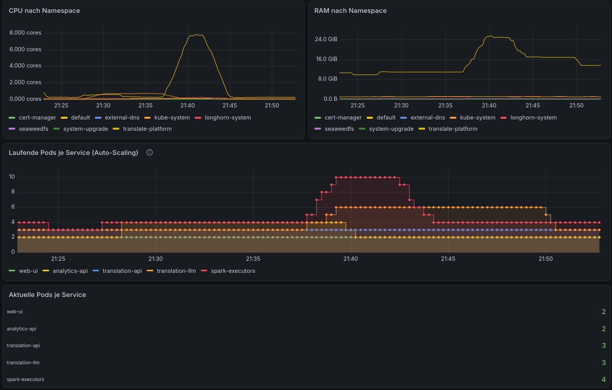

Im Panel "Laufende Pods je Service" zeigt die orange Linie die Skalierung von Translation LLM von 3 auf 6 Pods und zurück auf 3. Die gelbe Linie zeigt für Analytics API 2->4->2 Pods. Der CPU-/RAM-Verlauf darüber ordnet die Podzahlen den Lastphasen zu; das unterste Panel zeigt den abschließenden Stand. Translation API und Web-UI bleiben bei 3 beziehungsweise 2 Pods. Die [Rohprotokolle](docs/evidence/) enthalten ergänzend HPA-Zustände und CPU-Auslastung.

Die rote Spark-Kurve zählt Podnamen aus cAdvisor-Zeitreihen und zeigt etwa 4->10->4. Bei Executor-Ersatz können Zeitreihen alter und neuer Pods gleichzeitig in die Zählung eingehen. Die Kurve entspricht deshalb nicht unmittelbar der Zahl gleichzeitig laufender Executors. Die Spark-Konfiguration begrenzt diese auf vier; das [Executor-Protokoll](docs/evidence/spark-executors-under-load.txt) dokumentiert vier Pods sowie Pod-Ersatz, darunter nach `OOMKilled`.

`kubectl get pods` des `default`-Namespace am laufenden Cluster. Die vollständigen Nachweise enthalten die [Pod-Ausgabe für alle Namespaces](docs/evidence/cluster-pods.txt) und die [Übersicht der PersistentVolumeClaims (PVCs)](docs/evidence/cluster-pvc.txt):

```text
NAME                                         READY   STATUS    NODE
translation-kafka-main-0/-1/-2               1/1     Running   (3 Broker, persistent)
spark-streaming-job-759bcd9454-2bmfg         1/1     Running   (Driver)
spark-streaming-job-exec-1..4                1/1     Running   (Executors, Dynamic Allocation)
translation-llm-0/-1/-2                       1/1     Running   (StatefulSet, HPA 3-6)
translation-api-5658f5f78d-{4lrjp,qjvsj,rdb9b} 1/1   Running   (Deployment, HPA 3-8)
analytics-api-5c6bb47f54-{6dct7,bjqjf}        1/1     Running   (HPA 2-5)
web-ui-bf457bfdd-{9lqkc,chhbf}                1/1     Running   (HPA 2-5)
analytics-db-0, registry, strimzi-cluster-operator, kafka-entity-operator   1/1/2   Running
# seaweedfs (eigener Namespace): master-0, volume-0, filer-0 Running, bucket-init Completed

$ kubectl -n default get hpa
NAME              REFERENCE                     TARGETS       MIN   MAX   REPLICAS
analytics-api     Deployment/analytics-api      cpu: 2%/70%   2     5     2
translation-api   Deployment/translation-api    cpu: 1%/70%   3     8     3
translation-llm   StatefulSet/translation-llm   cpu: 0%/70%   3     6     3
web-ui            Deployment/web-ui             cpu: 2%/70%   2     5     2
```

### Verteiltes Tracing (Ende-zu-Ende)

Ein `/translate`-Trace umfasst Gateway und Modellservice als verschachtelte Spans. Tempo kennt `translation-api`, `translation-llm` und `analytics-api`.

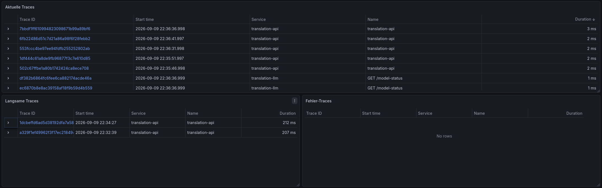
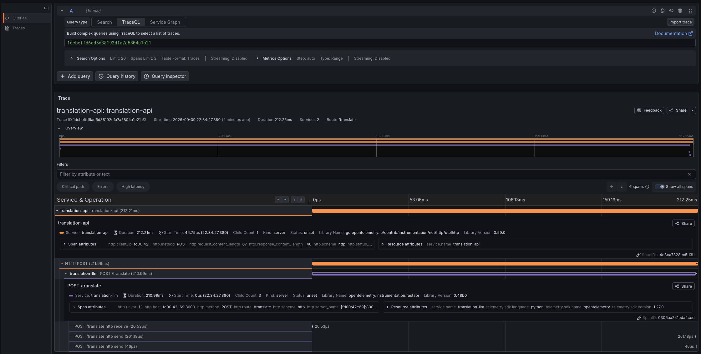

### Observability (Metriken und Logs)

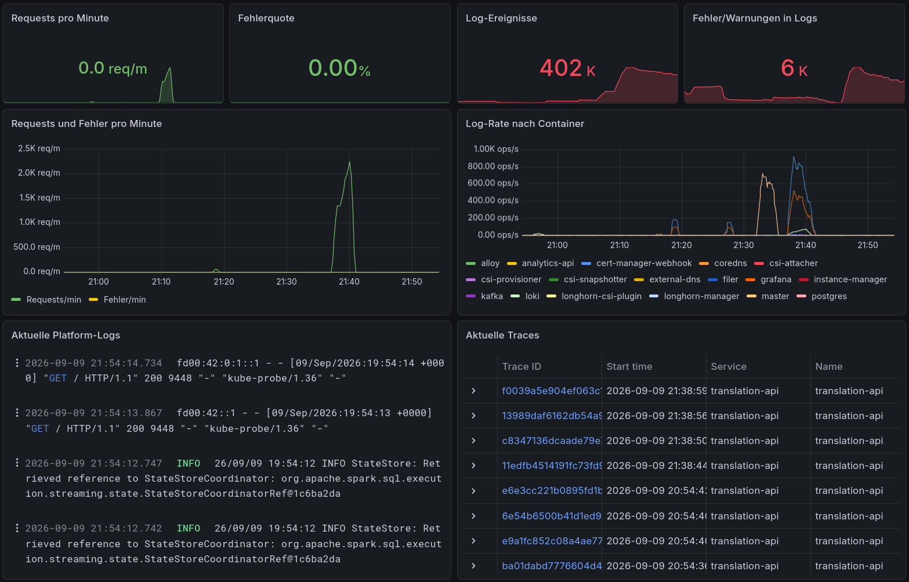
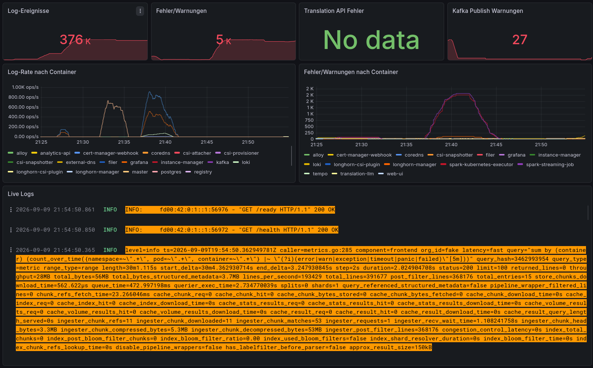

### Pipeline-Beispiel-Outputs

Die folgenden Auszüge zeigen unterschiedliche Anfragen und Verarbeitungszeitpunkte. Bis Silver erfolgt die Zuordnung über `req_id`; ab Gold werden die Ereignisse nach Sprachpaar bzw. Nutzerkennung und Eventzeitfenster zusammengefasst.

Synchrone API-Antwort auf `POST /translate` (echt):

```json
{"translated":"Good morning","model":"Helsinki-NLP/opus-mt-de-en","latency_ms":100,"req_id":"fa6b063c4f32ef428fa0488d67b43624"}
```

Parallel zur HTTP-Antwort veröffentlicht die API das Telemetrie-Event asynchron nach Kafka. Erfolgs-Event aus `translation-events` (zugleich das in Bronze abgelegte `raw_event`):

```json
{"req_id":"546d9f2dc5d98e67957b15e6874a0f0e","src":"local",
 "user_id_hashed":"c18c1b7d9fd7186aa379246a65df51079c9103b703a14cf9921e44712b800881",
 "src_lang":"de","tgt_lang":"en","char_count":15,"model":"Helsinki-NLP/opus-mt-de-en",
 "status":"success","latency_ms_total":124,"latency_ms_translate":124,
 "event_ts":"2026-09-09T18:42:16.259245955Z"}
```

Fehler-Event aus `translation-errors`: gleiches Schema, aber `status:"error"` plus `error_type` (hier ein Timeout beim Kaltstart eines seltenen Modells, `de-hr`):

```json
{"req_id":"f259a64847f6625602bb87e18a68bd9b","src":"web-ui",
 "user_id_hashed":"cebf292c038fdcd2de5f7ac62c3b81bcfe4efc535383031d762b06b26cfabea2",
 "src_lang":"de","tgt_lang":"hr","char_count":23,"status":"error",
 "latency_ms_total":51756,"latency_ms_translate":51756,
 "event_ts":"2026-09-09T20:07:18Z","error_type":"llm_unavailable"}
```

Silver ergänzt Sprachname/Schrift/Familie (statische Joins). Die Fensteraggregation landet in Gold und wird per Upsert nach PostgreSQL gespiegelt. Echter Auszug aus `language_pair_windows`:

```text
window_type | window | language_pair | request_count | avg_latency_ms | error_count | error_rate
1m          | 22:38  | de-en         | 1             | 100            | 0           | 0.00
5m          | 20:43  | de-fi         | 1             | 23251          | 0           | 0.00
5m          | 20:42  | de-hr         | 1             | 176            | 0           | 0.00
```

Die hohe Latenz bei `de-fi` (≈23 s) entsteht durch die erste Anfrage eines noch nicht geladenen Sprachpaars. Hot pairs wie `de-en` liegen darunter.

Die Nutzer-Burst-Erkennung schreibt zudem `user_alerts`. Aus dem Lasttest: eine Kennung mit sehr vielen Anfragen im Fünf-Minuten-Fenster:

```text
alert_type                | window | user_hash     | request_count | language_pair_count
many_requests_per_user_5m | 19:35  | 823938033bec… | 5256          | 1
```

## 12. Grenzen des Prototyps, Eigenanteil und Ausblick

### Scope und Prioritäten

Der Prototyp verbindet reale Übersetzungsanfragen mit einer implementierten Streaming-Analyse und deklarativen Kubernetes-Ressourcen. Er demonstriert Enrichment und zustandsbehaftete Zeitfenster, wurde end-to-end auf einem k3s-Cluster ausgeführt ([Abschnitt 11](#11-screenshots-und-nachweise)), und die Kern-Pipeline skaliert horizontal und autoskaliert unter Last. Die folgenden Punkte bleiben bewusst außerhalb des Prototyp-Scopes bzw. sind offene Grenzen:

- Zustellung / Exactly-once: Das Telemetrie-Event wird asynchron nach der HTTP-Antwort publiziert (Best-Effort, kein dauerhafter Outbox-Puffer). Bei Broker-Ausfall kann ein Event verloren gehen. Gold-Delta-MERGE und PostgreSQL-Upsert sind jeweils idempotent pro Fensterschlüssel, aber nicht atomar über Kafka+Delta+PostgreSQL gekoppelt, und es gibt keine `req_id`-Deduplizierung. Eine tabellenübergreifende Exactly-once-Kette wird daher nicht beansprucht.
- Persistenz / High-Availability: Kafka läuft persistent mit drei Brokern (RF 3). PostgreSQL ist jedoch ein einzelner Schreib-Knoten (Write-Skalierung bräuchte einen Operator wie CloudNativePG/Patroni oder verteiltes SQL); SeaweedFS-Master/Filer-Metadaten und die Observability-Dienste sind Einzelinstanzen; die Registry ist nicht persistent, dient hier jedoch nur als Ersatz für die offizielle Docker Registry, um einfacher testen zu können. PVCs bedeuten weder Replikation noch automatische Ausfallsicherheit.
- Skalierungssignal / Node-Autoscaling: `translation-api` (I/O-gebundenes Gateway) und `web-ui` (statisch) skalieren auf CPU praktisch nicht. Ein aussagekräftigeres Signal wäre die In-Flight-Request-Zahl des Routers (Custom-Metric-HPA via Prometheus-Adapter). Node-Level-Autoscaling (mehr VMs on demand) ist nicht umgesetzt; die HPA-Obergrenzen sind durch die Node-Kapazität gedeckt. Der Spark-Postgres-Sink zieht Gold-Zeilen weiterhin per `collect()` zum Driver.
- Wiederaufbau: `reprocess` überschreibt Tabellen, ist nicht mit dem Live-Job koordiniert und entfernt keine veralteten PostgreSQL-Zeilen. Es fehlt eine sichere Umschaltung zwischen Ergebnisgenerationen.
- Datenbedeutung: Die UI nutzt einen gemeinsamen Demo-Nutzerhash. Ein Burst bedeutet deshalb nicht zwingend einen einzelnen auffälligen Menschen. SHA-256 ohne weitere Maßnahmen ist keine Anonymitätsgarantie. Übersetzungsqualität und alle Katalogpaare sind nicht systematisch geprüft.
- Betrieb: API-Readiness prüft Abhängigkeiten nicht; Modell-Readiness kann auch nach fehlgeschlagenem Preload TRUE werden. Fremd-Images (Observability per Digest), Strimzi, Terraform-Provider und die Ansible-Rolle/Collection sind auf feste Versionen/Digests gepinnt; nicht fixiert bleiben die eigenen `:latest`-Service-Images (aus gepinnten Quellen neu gebaut) sowie die zur Laufzeit geladenen Modellgewichte und Kataloge. Der synchrone `/translate`-Trace ist verschachtelt (Gateway->Modellservice); der asynchrone Kafka->Spark-Zweig ist nicht in denselben Trace eingebunden (Spark ist nicht OTel-instrumentiert).

Die nächste Ausbaustufe sollte den Wiederaufbau atomar absichern, Versionen/Digests fixieren und bei Bedarf die Serving-DB replizieren oder auf eine verteilte Serving-Schicht wechseln.

### Eigenanteil und Git-History

Die Aufgaben waren nach Teilsystemen aufgeteilt:

| Git-Autor | Verantwortungsbereich |
|---|---|
| `0LGuenth` | Infrastruktur-Grundgerüst (Terraform/Ansible), Translation API (Gateway) und Modellservice (LLM) inklusive Satzsegmentierung, LRU-Cache und Router; verteiltes Tracing der Übersetzungskette |
| `Max Peyker` | Kafka-Ingestion, PostgreSQL-Serving und Analytics API, Observability (Grafana/Prometheus/Loki/Tempo inkl. Dashboards) sowie Deployment-Automatisierung und Autoskalierung (HPAs) |
| `Tabbbi` | Web-UI: Oberfläche, Anbindung an die Translation API, Sprachauswahl, Modellstatus-Anzeige und Layout |
| `Tizian1103` | Storage (SeaweedFS/Delta) und die gesamte Spark-Structured-Streaming-Verarbeitung (Bronze/Silver/Gold, Windowing, idempotente Sinks) sowie der skalierbare Spark-auf-Kubernetes-Betrieb und die Kafka-Skalierung |

Eigene Leistung sind insbesondere die Service-Integration, das Event-/Auswertungsmodell, der Router, die UI, der Spark-auf-Kubernetes-Betrieb und die Infrastrukturzusammenstellung. Kafka, Spark, Delta, SeaweedFS, PostgreSQL, die Observability-Produkte, OPUS-MT-Modellgewichte und die Kursrolle sind Fremdsoftware.

### Begründete Eigenständigkeit und mögliche Bonusaspekte

SeaweedFS statt HDFS: Der S3-kompatible Zugriff passt zu Delta/S3A und trennt Dateispeicherung vom Spark-Rechenprozess. Die Aufteilung in Master, Filer und Volumes macht Speicherrollen explizit und vermeidet eine direkte HDFS-Bindung. Der Preis ist ein zusätzlicher Metadaten-/Konsistenzbedarf. Die Eininstanz-Konfiguration demonstriert noch keine verteilte Ausfallsicherheit.

Modellbewusstes Routing: Für oft genutzte Paare verteilt der Router Last über alle Modell-Pods, für seltene Paare begrenzt die Hash-Auswahl die Zahl möglicher Modellkopien. Der LRU-Cache hält im Manifest höchstens sechs Modelle pro Pod und schützt vorgeladene Paare vor Verdrängung. Der Nutzen ist eine begründbare Balance zwischen Cache-Ausnutzung und Parallelität.

Autoskalierung: Vier CPU-HPAs plus Spark Dynamic Allocation skalieren die Kern-Pipeline automatisch mit der Last. Der Lasttest belegt konkrete Scale-up/down-Reaktionen (translation-llm 3->6, analytics-api 2->4, Spark-Executors 1->4) mit Rohprotokollen in [docs/evidence/](docs/evidence/) und Grafana-Panels in [Abschnitt 11](#11-screenshots-und-nachweise).

Verteiltes Tracing: Translation API, Translation LLM und Analytics API sind OTel-instrumentiert; ein `/translate`-Trace verbindet Gateway und Modellservice. Das verbessert die Nachvollziehbarkeit des Ende-zu-Ende-Flusses über die reine Übersetzung hinaus.
